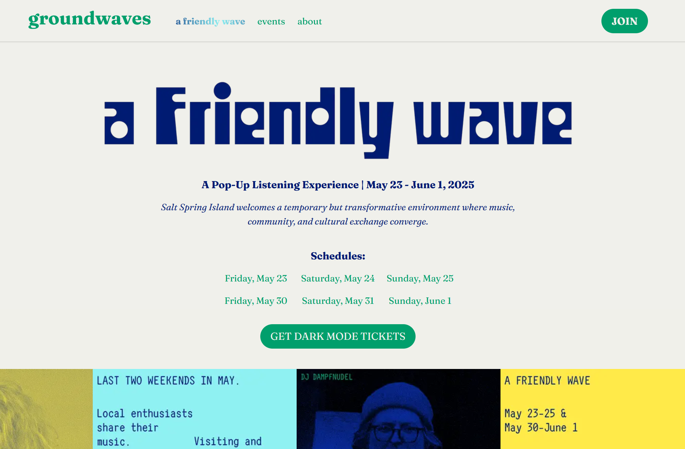

# groundwaves.live

A modern website for a music event organization built with Astro, featuring content management through Sanity CMS and responsive design with Tailwind CSS.



## Technologies

- **Astro** - Static site generator with component islands architecture
- **Sanity CMS** - Headless content management system
- **Tailwind CSS** - Utility-first CSS framework
- **TypeScript** - Type-safe development

## Setup

Node.js 22.12 or newer is required.

```bash
pnpm install        # Install dependencies
pnpm run codegen    # Generate TypeScript types from Sanity schemas
```

The `codegen` command extracts your Sanity schema and generates TypeScript types in `sanity.types.ts`. Run this after cloning the repo or whenever you modify Sanity schema definitions.

## Development

```bash
pnpm run dev        # Start development server at localhost:4323
pnpm run build      # Build production site
pnpm run preview    # Preview production build
pnpm run codegen    # Regenerate Sanity types after schema changes
```

## Deployment

Deployed to Netlify at [groundwaves.live](https://groundwaves.live)
